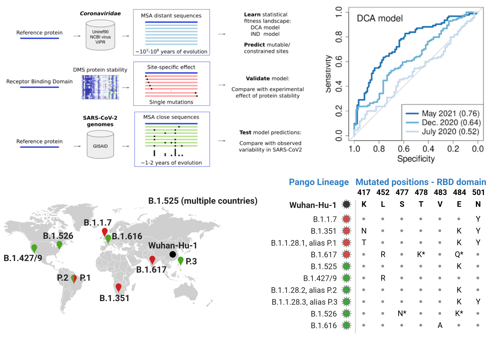
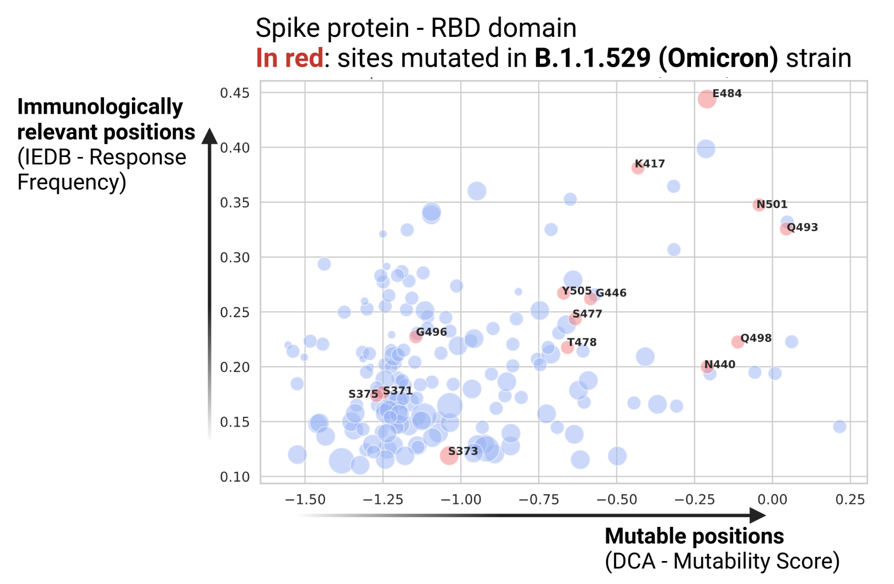

**Epistatic models predict mutable sites in SARS-CoV-2 proteins and epitopes**

For each site of the SARS-CoV-2 Wuhan-Hu-1 proteome (Accession [NC_045512](https://www.genome.jp/dbget-bin/www_bget?refseq:NC_045512)) included in a [PFAM domain](http://pfam.xfam.org/), we introduce a  [Direct Coupling Analysis](https://en.wikipedia.org/wiki/Direct_coupling_analysis) (DCA) **mutability score to predict mutable and constrained sites**. 


Sites of the SARS-Cov-2 Wuhan-Hu-1 proteome with high *DCA-Mutability Scores* are more likely to mutate. We validate our mutability predictions with the mutations observed in SARS-CoV-2 proteomes deposited in the [GISAID](https://www.gisaid.org/) database.

Paper: [Epistatic models predict mutable sites in SARS-CoV-2 proteins and epitopes](https://www.pnas.org/content/119/4/e2113118119) Rodriguez-Rivas, Giancarlo Croce, Maureen Muscat, Martin Weigt, PNAS January 25, 2022 119 (4) e2113118119; https://doi.org/10.1073/pnas.2113118119.



Run the Jupyter-notebook ```dca_sarscov2.ipynb``` on Google Colab at [this link](https://colab.research.google.com/github/GiancarloCroce/DCA_SARS-CoV-2/blob/main/dca_sarscov2.ipynb) to reproduce key results from the paper and guide the data analysis. Colab allows you to execute the Python code through your browser (no need to clone the GitHub repository on your local machine). 
The code for training sequence-based models to predict mutability scores is available at [https://github.com/juan-rodriguez-rivas/covmut](https://github.com/juan-rodriguez-rivas/covmut). 


The results of our analysis are also available in the ```./data ``` folder on the [Github page](https://github.com/GiancarloCroce/DCA_SARS-CoV-2/)

The data structure is:
```
protein  domain	      position_protein  position_domain  aa_Wuhan-Hu-1  mutability_score(IND) 	mutability_score(DCA)  observed_mut_May2021  observed_mut_Dec2020  observed_mut_Jul2020
Spike  	 bCoV_S1_RBD  349               1.0              S              -1.3818			-1.2046			0.0                   0.0                   0.0
Spike  	 bCoV_S1_RBD  350               2.0              V              -1.9788			-1.1667			3.0                   0.0                   0.0
Spike  	 bCoV_S1_RBD  351               3.0              Y              -1.8017			-1.2678			8.0                   1.0                   1.0
Spike    bCoV_S1_RBD  352               4.0              A              -1.0140			-1.1347			23.0                  3.0                   0.0
```

We combine our *DCA-Mutability Score* with the [IEDB](https://www.iedb.org/) site response frequency (*IEDB-Response Frequency*). This allows us to identify mutable (high DCA-Mutability Score) and immunologically relevant sites (high IEDB - Response Frequency). Amino acid substitutions at high-RF sites have a higher risk of inducing immune escape as many positively responding B and T cell epitopes are modified.  



A key advantage of our data-driven modeling approach is the possibility to obtain predictions for all the protein domains in the SARS-CoV-2 proteome. Run the Jupyter-notebook to extend the DCA predictions to all 39 protein domains covering 81% of the entire proteome (8037 out of 9748 positions), and combine them with immunological IEDB data.
