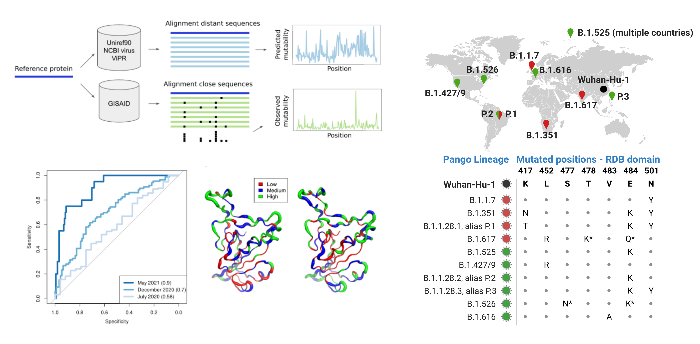

**Epistatic model predict SARS-CoV-2 mutability of proteins and epitopes**

For each site of the SARS-CoV-2 Wuhan-Hu-1 proteome (Accession [NC_045512](https://www.genome.jp/dbget-bin/www_bget?refseq:NC_045512)), we introduce a  mutability score
to predict SARS-CoV-2 mutable and constrained sites.
Our modeling is based on the [Direct Coupling Analysis](https://en.wikipedia.org/wiki/Direct_coupling_analysis) model. 

Predictions are validated using the genomes of SARS-CoV-2 strains from the [GISAID](https://www.gisaid.org/) database.

Paper: [papername](link_to_paper).


The results of the analysis for the whole proteome are available [here](https://github.com/GiancarloCroce/DCA_SARS-CoV-2/blob/main/data/data_dca_whole_proteome.csv) as a .csv file.

The data structure is:

```
protein  domain	      position_protein  position_domain  aa_Wuhan-Hu-1  mutability_score(IND)  mutability_score(DCA)  observed_mut_Mar2021  observed_mut_Nov2020  observed_mut_Jul2020
Spike  	 bCoV_S1_RBD  349               1.0              S              -3.7992                -7.0714                0.0                   0.0                   0.0
Spike  	 bCoV_S1_RBD  350               2.0              V              -5.4405                -6.8487                1.0                   0.0                   0.0
Spike  	 bCoV_S1_RBD  351               3.0              Y              -4.9535                -7.4424                6.0                   1.0                   1.0
Spike    bCoV_S1_RBD  352               4.0              A              -2.7878                -6.6612                17.0                  3.0                   2.0
```

For the site of the RDB domain, we also include the [IEDB](https://www.iedb.org/) site response frequency and the corresponding 95% confidence interval upper/lowerbound.

```
protein  domain	      position_protein	... 	IEDB_upperbound  IEDB_lowerbound  IEDB_response_frequency
Spike  	 bCoV_S1_RBD  349             	... 	0.10             0.05             0.073563
Spike  	 bCoV_S1_RBD  350             	... 	0.10             0.05             0.069284
Spike  	 bCoV_S1_RBD  351             	... 	0.11             0.06             0.083333
Spike    bCoV_S1_RBD  352             	... 	0.10             0.05             0.069212
```

We provide a Jupyter-notebook [here](https://github.com/GiancarloCroce/DCA_SARS-CoV-2/blob/main/paper_dca_sarscov2.ipynb) to guide data analysis and reproduce the paper results.
